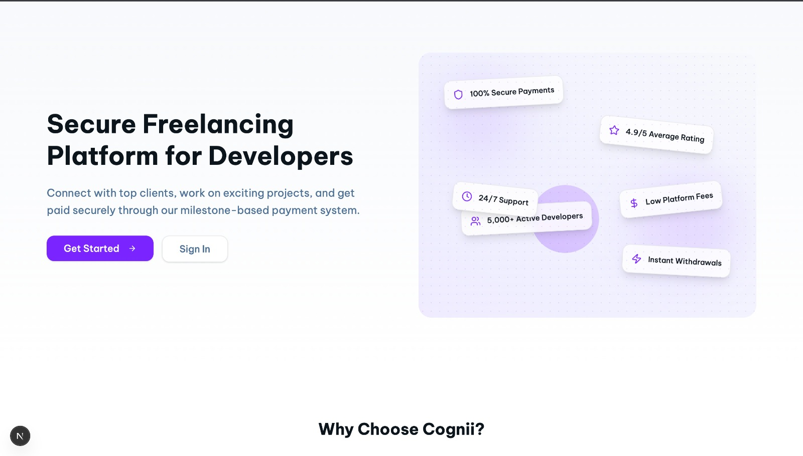
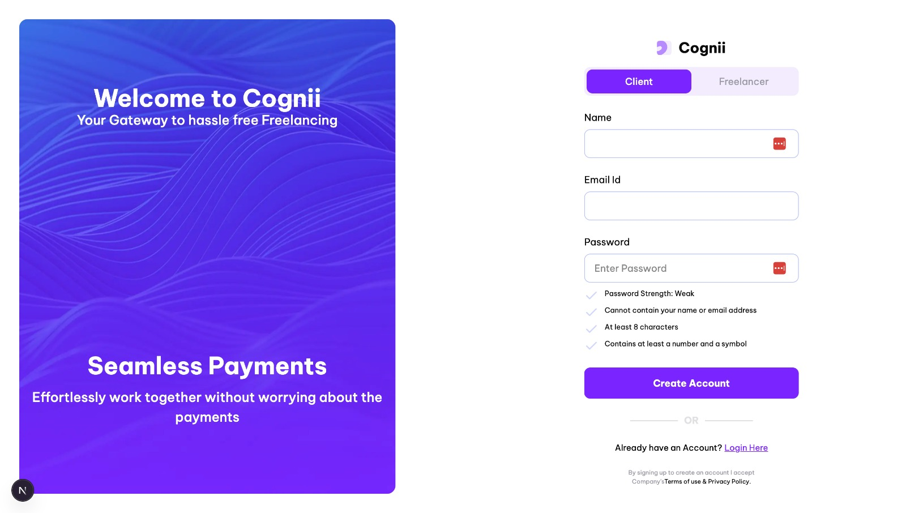
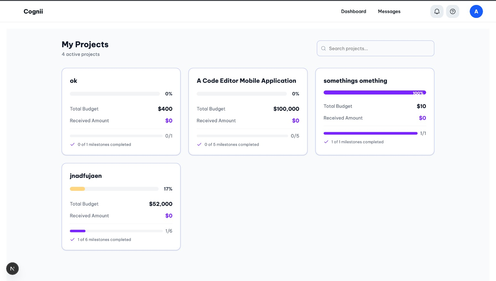
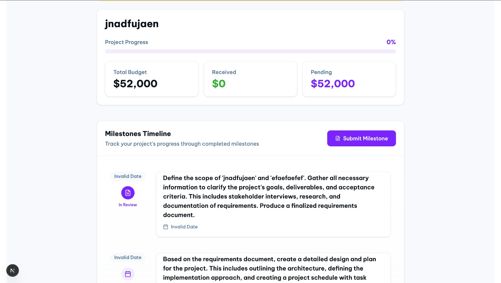
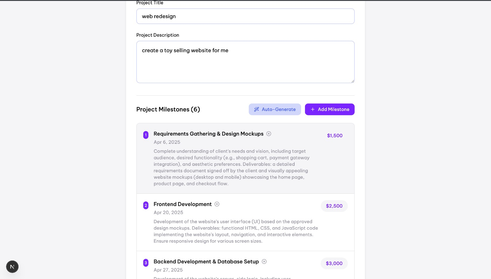
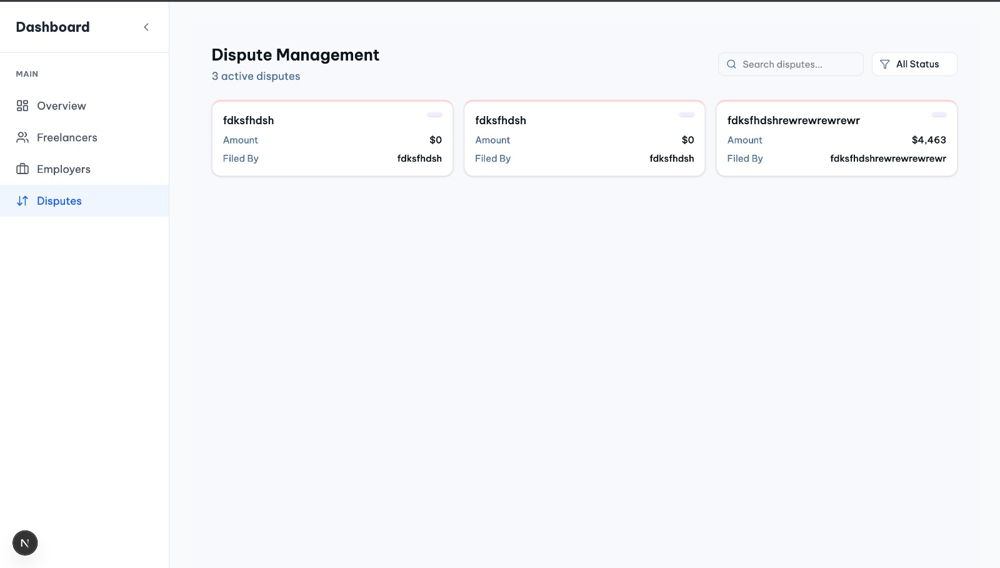

#  Cognii

**Cognii** is a freelancing platform that connects clients with top professionals. Clients can book freelancers for projects, and payments are securely released from an escrow system based on completed milestones.

## Features

- **Secure Payments**: Milestone-based escrow ensures fair and secure transactions.
- **Escrow System**: Funds are released upon milestone completion.
- **User Authentication**: Secure login and registration for both clients and freelancers.
- **AI-Powered Milestone Generation**: AI assists clients in generating project milestones.
- **Dispute Resolution System**: A structured process for resolving payment and project disputes.

## Screenshots








## Tech Stack

- **Frontend**: Next.js, React
- **Backend**: Express.js, Node.js
- **Database**: MongoDB
- **Styling**: Tailwind CSS
- **Authentication**: JWT (JSON Web Tokens)

## Installation and Setup

### Prerequisites

Ensure you have the following installed:

- **Node.js** (v14.x or higher)
- **npm** or **yarn**
- **MongoDB** (if running locally)

### Clone the Repository

```bash
git clone https://github.com/raghavg18/cogni.git
cd cogni
```

### Install Dependencies

#### Backend

```bash
cd user_backend
npm install
```

#### Frontend

```bash
cd ../user_frontend
npm install
```

### Starting the Servers

#### Start Backend Server

```bash
cd user_backend
node index.js
```

The backend server will run on `http://localhost:8000`.

#### Start Frontend Server

```bash
cd user_frontend
npm run dev
```

The frontend will run on `http://localhost:3000`.

## Workflow Example

1. **Signup / Login**: Users (freelancers and clients) register and log in.
2. **Freelancer Registration on Stripe**: Freelancers set up their payment accounts via Stripe.
3. **Client Creates a Job**: Clients post job requirements, with AI assisting in milestone generation.
4. **Payment to Escrow**: Clients deposit the full project payment into an escrow account.
5. **Milestone Completion**: Upon completion of each milestone, the escrow releases the agreed-upon funds to the freelancer.
6. **Dispute Resolution**: If conflicts arise, a structured dispute system facilitates resolution.

## Deployment

The project is deployed at: [Cognii Live](https://cogni-gamma.vercel.app)

## API Endpoints

### User Endpoints

- `POST /signup`: Register a new user.
- `POST /login`: Authenticate a user and return a JWT.
- `GET /user/:username`: Retrieve user information.

### Project Endpoints

- `POST /create-project`: Create a new project.
- `GET /project/:projectId`: Get details of a specific project.
- `PUT /project/:projectId/assign-freelancer`: Assign a freelancer to a project.

### Milestone Endpoints

- `POST /submit-milestone`: Submit a milestone for review.
- `POST /release-payment`: Release payment for a completed milestone.

